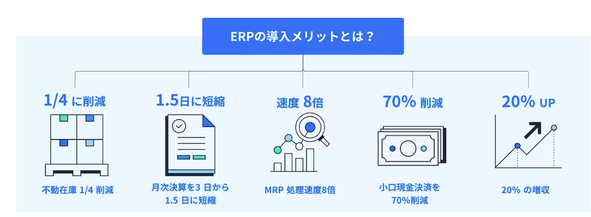

# ERPとは
Enterprise Resources Planning（企業資源計画）の略であり、企業経営の基礎となる資源の要素、
**経理・財務、人事、調達・購買、販売、製造、サプライチェーン、サービス、開発**などを全て一元管理し、
企業資源を無駄なく有効活用して生産性を向上する考え方を基に、ビジネス全体の経営の効率化を目指すことを主な目的とします。
日本語では、 統合基幹業務システム、又は基幹系情報システムと呼ばれます。

## ERP導入のメリット

### その他のメリット
1．業務効率と生産性の向上：
部門ごとのデータ共有が一元管理によって容易になり、コミュニケーションの向上はもちろん、企業全体の効率化が実現します。
また、リアルタイムのデータアクセスと分析が可能になるため、多様な業務に対する対応が速やかにでき、全体的な生産性も向上します。
2．コストの削減：
ERP 導入により、データ入力や計算などの手作業を自動化し、AI などを活用してインサイトを提供する機能によって、手作業にかかる人件費を削減できます。
3．コンプライアンスの強化：
ERP システムは、基本的に各国の法規制や業界標準に準拠した機能を備えているため、コンプライアンスや内部統制の強化も実現します。
4．経営の可視化が実現：
ERPなら、企業全体のパフォーマンスを可視化でき、パフォーマンスレポートなどのデータの可視化が実現し、
経営者が各部門の状況やパフォーマンスを一目で把握することが可能になります。これによって、より適切な戦略を立てることが実現します。

