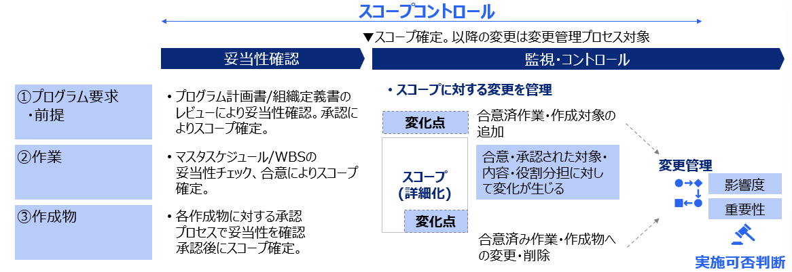
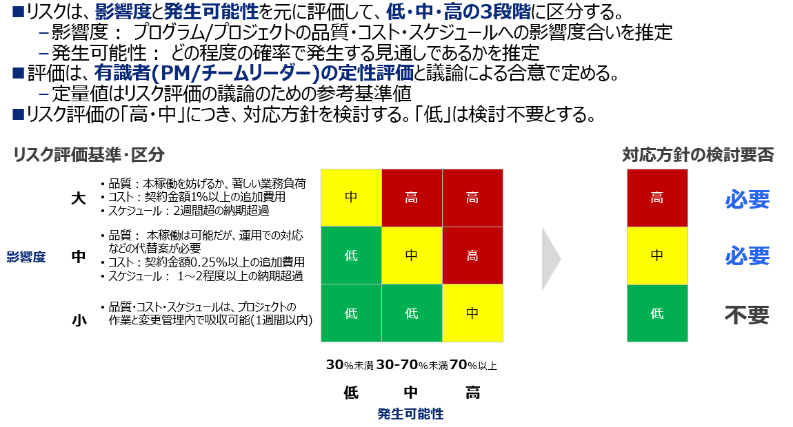

# 1．プログラム要求・前提スコープ定義
## ①．組織：対象となる会社・事業部はどこか？
    ・プログラム計画書の法人・組織スコープ

## ②．業務：対象となる業務はどの範囲か？
    ・プログラム計画書の業務スコープ
    ・業務フロー一覧

## ③．システム：導入対象システムはどの範囲か？
    ・プログラム計画書のシステムスコープ
    ・アプリケーションマップ

# 2．作業スコープと作成物スコープ
定義した作業スコープおよび、作成物スコープを基準にWBSを作成し、進捗管理を行う。
→スコープ・ベースラインドキュメント

## ①作業スコープ
    ・フェーズ
        対象フェーズで実施する作業は何か？
    ・タスク
        実施対象のタスクの目的
        作成物との関係
    ・役割
        タスクに対する作業主体、責任対象は？

## ②作成物スコープ
    ・作成対象、フェーズ
        各フェーズで作成、更新する対象は何か？
        サインオフ（変更管理開始）タイミングはいつか？
    ・役割
        対象作成物を更新、承認する際の役割は？

# 3．スコープコントロール
スコープコントロールは以下の２ステップで構成される。
・妥当性確認：ベースラインとなるドキュメントの承認作業。
    これを契機にスコープ管理の運用を開始する。
・監視・コントロール：合意/承認されたスコープに対する変更要求に対して、
    影響度/重要度を勘案し、実施の可否を判断する。（変更管理プロセスによる運用）
    影響度が大きい変更は、PM判断を求める。

変更管理は、原則、プロジェクト単位で可否判断を実施。
## 変更管理プロセス
1．変更要求の認識
    変更が必要になった背景や要因など、変更理由を明確化
2．対応案検討
    変更点への対応案、対応しなかった場合の代案を検討
3．影響範囲確認
    対応案に対する作業・各種作成物への影響範囲を特定
4．対応工数見積もり
    確認した影響範囲へ変更を行うための作業工数見積もり実施
5．実施可否判断
    **変更理由、対応案、工数、影響範囲を踏まえ実施可否を判断**
6．変更適用・確認
    変更適用承認後、各種作成物・システム対応を実施、結果確認

## リスク評価と対応方針

・高・中リスクに対して「回避」「軽減」「転嫁」「受容」による対応方針を立案する。

### 回避
・対策の実施によって、**リスクとなる原因と取り除く**
・主に計画段階では、リスク識別時点で、作業方針・アプローチ・計画を変更することによってリスクを避ける。
    ex) 計画段階で、新技術でなく、実績のある既存技術を採用する。

### 軽減
・対策の実施によって、**リスクの発生確率とリスクの発生時の影響度**のどちらか、または両方を軽減させる。
・対策によって受容可能とするか、リスク影響度が高い場合には、緊急時対応計画を検討する。
    ex) 新技術の採用前に、事前継承工程（PoCなど）を追加する。

### 転嫁
・リスク事象をアウトソーシングや保険契約などによって、第三者の責任・負担への転嫁する。

### 受容
・リスク事象に対して、計画変更などの対策を打たずに、リスクを認知の上で受容する。
・予防的対策が困難なリスクが想定される。
　リスク影響度が高い場合は、事後対応として**緊急時対応計画**を検討する。
    ex)新技術による重大な問題が結合テストまでに発生した場合は、既存技術に切り替える。
