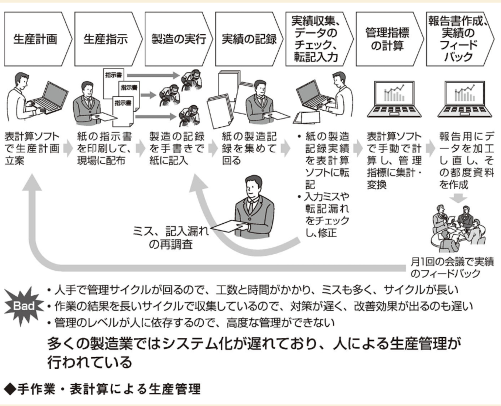

# これまでは作れば売れる時代
少品種大量生産の時代
**生産性指標と品質指標を中心に管理**
　→  
    設備の稼働率を上げる  
    時間あたりの出来高を上げる  
    良品率を上げる  

    納期管理
    　生産計画に対する実績（納期厳守）
   **QCD管理（Quality：品質、Cost：コスト、Delivery：納期**

結果、使われない材料の在庫が倉庫に溢れた。
→材料の在庫推移や売上推移の変動に合わせた**稼働率管理**を行う必要がある。
　　→計画的な稼働目標設定と制御、コスト最適化で無駄を排除した
　　　生産マネジメントとコントロールが必要。

## 販売・生産とも少量多品種になった
現場管理ではなく、計画的で先読みした生産マネジメントへ

人による生産管理

