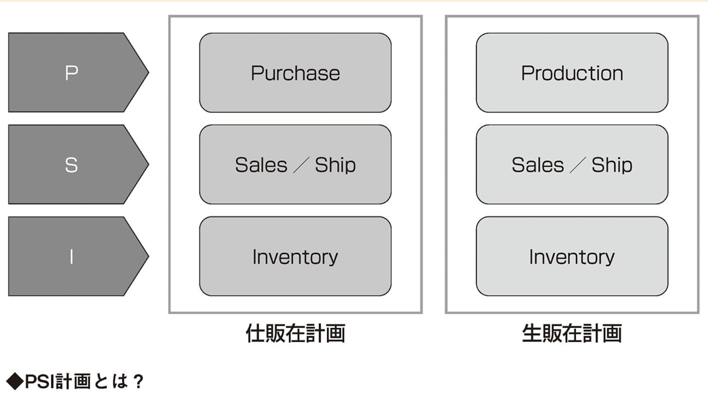

# 生産管理のフレームワーク

## 1．SCM機能
　**需要に対する計画業務機能**  
　**販売・出荷計画、在庫計画、仕入れ・生産(要求)計画**を立案する機能  
　→PSI計画とも呼ばれる  

purchase…購入  
inventory…在庫  

SCM計画は対象期間によって、月次計画、年度計画、長期計画がたてられる。

## 2．生産マネジメント機能
SCM機能から生産計画を受けて、  
生産と調達の必要数量（所要量）を計算し、基準となる生産計画を立てます。  

基本的に月次サイクルの生産・調達計画が、生産の指示、調達のもとになる
**製造指図、購買指図**を作る機能に繋がります。

また、生産計画を成り立たせるための**能力計画（設備稼働計画、人員計画）**も立案する。
月次能力計画は、**作業シフト計画**や**稼働調整**につながる。
長期能力計画は、設備投資計画、設備投資実行計画につながる。

### 2.1 購買マネジメント機能
サプライヤー選定や、契約・価格管理を行う**購買契約管理**と、**購買指図発行機能**がある。

