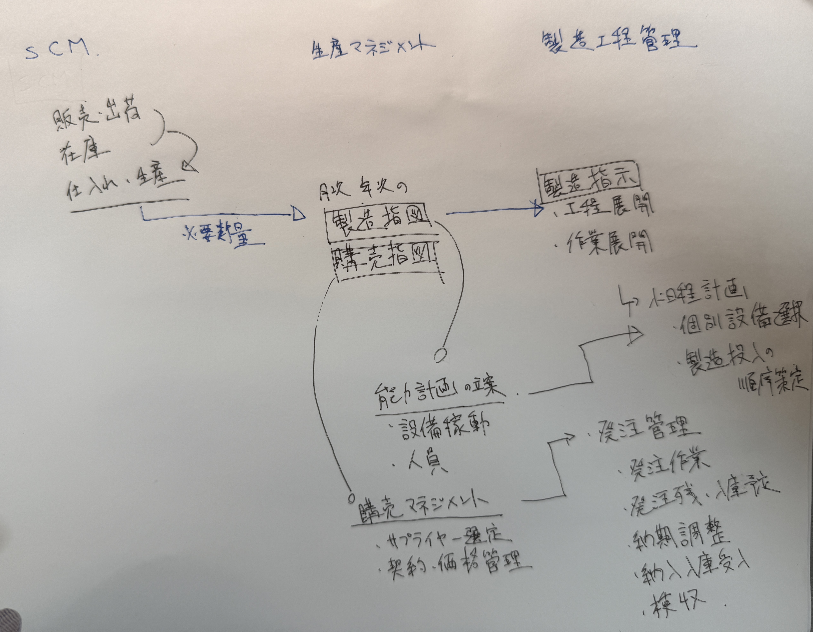

# 生産管理のフレームワーク  
  

## 生産管理の各システムと機能の詳細  
生産管理のフレームワーク  

### SCM機能（PSI計画）  
・需要予測機能  
・販売計画機能  
・在庫計画機能  
・生産要求計画機能  
・仕入れ計画機能  

### 生産マネジメント機能  
・生産計画（基準生産計画）、調達計画  
・製造指図、購買指図  
・購買契約管理（ソーシング）  
・原価計算  

### 製造・工程管理機能  
・小日程計画  
・製造指示  
・実績収集・管理  
・発注管理  
・入庫予定管理、受入  

### 工場ITインフラ  
・実績データ取得  
・設備制御  

## 1．SCM機能
　**需要に対する計画業務機能**  
　**販売・出荷計画、在庫計画、仕入れ・生産(要求)計画**を立案する機能  
　→PSI計画とも呼ばれる  

purchase…購入  
inventory…在庫  

SCM計画は対象期間によって、月次計画、年度計画、長期計画がたてられる。

## 2．生産マネジメント機能
SCM機能から生産要求計画を受けて、  
生産と調達の必要数量（所要量）を計算し、基準となる生産計画と調達計画を立てます。  

基本的に月次サイクルの生産・調達計画が、生産の指示、調達のもとになる  
**製造指図、購買指図**を作る機能に繋がります。  

また、生産計画を成り立たせるための**能力計画（設備稼働計画、人員計画）**も立案する。  
月次能力計画は、**作業シフト計画**や**稼働調整**につながる。  
長期能力計画は、設備投資計画、設備投資実行計画につながる。  

### <生産マネジメントでは以下の機能も有する>
**・購買マネジメント機能**  
サプライヤー選定や、契約・価格管理を行う**購買契約管理**と、**購買指図発行機能**がある。  

**・原価計算**  
製造、工程管理から上がってくる実績データをもとに、原価計算を行う。  

## 3．製造・工程管理機能
製造指図を受けて、詳細な**工程展開や作業展開**を行い、続いて**製造指示**を行います。  
製造指示に基づいて行われた製造の実績を収集し、**指示と実績の管理**を行います。  

ロット管理やトレーサビリティの管理を実現するレイヤー。  

### 小日程計画機能  
工程の能力を考慮し、個別設備を選択して、製造投入の適正な順序を作る計画を立案する。  

### 発注管理（Purchasing）  
購買指図を受けて行う。 ※下記作業を発注管理として行うため、製造・工程管理機能とする。  
発注作業、発注残・入庫予定管理、納期調整、納入入庫受入、検収  

